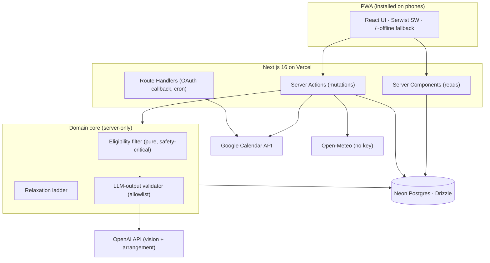
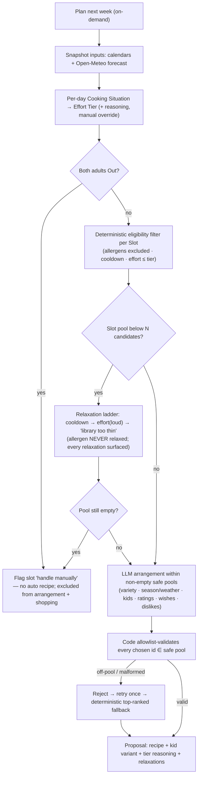
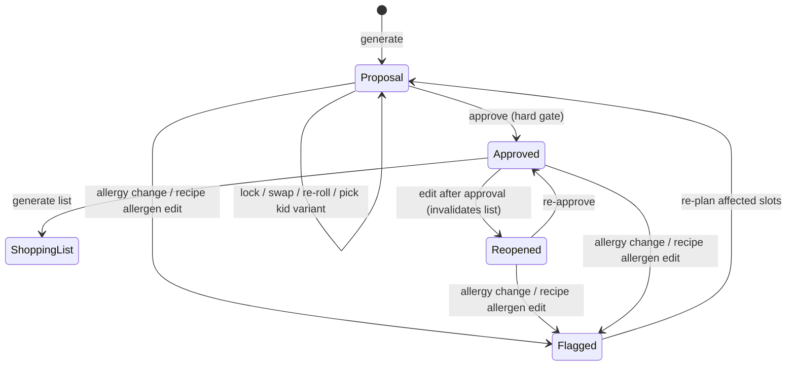
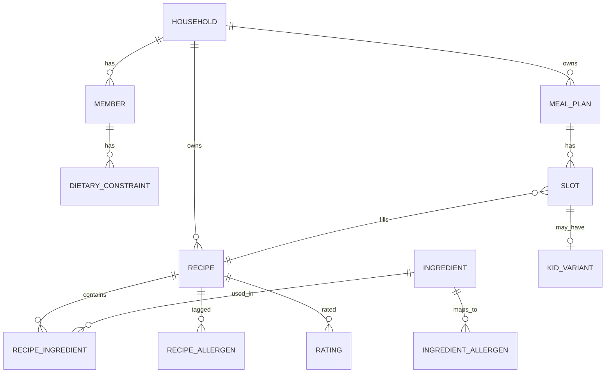

# feat: Build famealyplaner v1 — full meal-planning PWA

## Summary

Build the complete famealyplaner v1: an installable Next.js PWA (Vercel + Neon Postgres) where two adults log in with Google, import and curate a family Recipe Library, and generate a weekly dinner plan whose safety is guaranteed by deterministic code and whose pleasantness is arranged by an LLM. The work lands in eight dependency-ordered phases — foundation, domain + library, photo import, cold-start, planner inputs, the two-stage planner, review/approval/shopping, and the feedback loop — each leaving the app runnable. REWE auto-ordering is out (v2 stretch); the categorized Shopping List is the self-sufficient v1 endpoint.

---

## Problem Frame

A two-adult, two-kid household wants to stop re-deciding dinner every week. The hard constraint is medical: the 4-year-old has a true nut allergy (hazelnut, macadamia), so a meal plan that surfaces an unsafe recipe is not a bug, it is a hazard. The design answer (ADR-0001) is to split the planner — deterministic code computes the *safe, eligible* pool of recipes per meal slot, and the LLM only *arranges and ranks* within that already-safe pool. Around that core the app needs recipe capture (photo import is the flagship convenience), calendar-aware effort sizing (a hard recipe on a solo-parent night breaks the promise), soft taste/weather/season nudges, human approval before anything is "real," and a shopping list that actually gets used in the store.

Nothing is built yet — the repo holds only `CONTEXT.md` and `docs/adr/0001-deterministic-allergen-filter-llm-arranges.md`. This plan takes it from empty to a deployable v1.

---

## Requirements

### Platform & access

- R1. The app is an installable PWA usable on the adults' phones, built on Next.js (App Router) and deployed on Vercel.
- R2. Access is restricted to a hardcoded two-email allowlist; there is exactly one shared Household with equal read/write for both adults; no public sign-up, no multi-tenancy.
- R3. A single Google OAuth consent grants both login and Google Calendar read access.

### Recipe Library & import

- R4. A Recipe is structured: ingredients with quantities/units, prep/cook time, effort tier, allergen tags, season tags, and `deconstructable` / `kid-adaptable` flags.
- R5. Recipes enter the Library three ways — the one-time LLM-proposed starter set, manual entry, and photo import; the planner only ever selects from the Library, never inventing a recipe for a plan.
- R6. Photo import uses a vision LLM to extract a structured draft from one or more uploaded images; allergen detection is conservative and flags uncertainty rather than asserting safety.
- R7. Every imported and every starter-set recipe is human-confirmed before it is saved, with an allergen-confirmation step the user cannot skip.

### Allergen safety (medical, load-bearing)

- R8. Allergen exclusion is enforced in deterministic, unit-tested code and human-confirmed data — never by an LLM judgment at plan time (ADR-0001).
- R9. A recipe is ineligible for any Member with a matching allergy if it `contains` the allergen *or* carries `may_contain_traces` risk; allergen exclusion can never be relaxed or overridden.
- R10. The allergen invariant holds on every recipe-placement path: starter set, photo import, plan generation, re-roll, and manual swap.

### Planning inputs

- R11. Per-day Effort Tier is auto-derived from a Cooking Situation merged from the household's Google Calendars (each adult's evening classified Home / Away / Out over the ~16:30–19:30 window), always shown with its reasoning, and always manually overridable.
- R12. A day where both adults are Out is flagged "handle manually" and is not auto-planned.
- R13. Weather (Open-Meteo, Cologne) and seasonality are soft signals that bias selection but never filter; planning proceeds normally when weather is unavailable.

### The planner

- R14. The planner computes a deterministic eligible-recipe pool per Slot (allergens excluded, cooldown respected, effort ≤ tier), then the LLM arranges/ranks within that already-safe pool for variety, season/weather mood, kid-friendliness, ratings, and Wishes.
- R15. The LLM may select only from the supplied safe pool; off-pool, malformed, or duplicate picks are rejected in code and never placed.
- R16. When a Slot's eligible pool is too thin to choose from, the planner relaxes deterministic constraints in a fixed order — cooldown, then effort tier (loudly flagged), then declare the Library too thin — and surfaces every relaxation. Within-week variety is pursued by the LLM arrangement layer, not the deterministic ladder; allergen exclusion is never relaxed.
- R17. Variety/cooldown keep plans fresh: a cooked recipe is suppressed ~3 weeks (shorter for 👍 favorites, with an exploration boost for new/unrated recipes), and never the exact same recipe two weeks running.
- R18. Wishes — standing preferences plus an optional per-week free-text wish — bias the LLM arrangement.

### Review, approval & shopping

- R19. A generated plan is a proposal; the user can lock, swap, or re-roll any Slot and choose a Kid Variant (toned-down / deconstructed) where the recipe supports it.
- R20. A manual swap is still allergen-filtered (hard); it may bypass soft constraints (cooldown/variety/effort) with an explicit flag.
- R21. Approval is a hard gate: only an approved Meal Plan can produce a Shopping List (or, in v2, a REWE order).
- R22. The Shopping List aggregates every approved Slot's recipe ingredients, merges duplicates, normalizes/sums units, scales to the Household portion size, excludes a static Staples list, and categorizes items for shopping. (Kid Variants are toned-down/deconstructed serving adaptations and add no ingredients of their own.)
- R23. The Shopping List is first-class: checkable and exportable.

### Feedback & integrity

- R24. After a meal is marked cooked, the Household records a rating (👍 / 😐 / 👎 plus a separate "kids liked it" flag) that feeds future planning.
- R25. When a Member's allergy changes — or a referenced recipe's allergen data is edited — active plans in any non-terminal state (Proposal, Reopened, Approved) are re-validated and any now-unsafe Slot is flagged for re-planning.
- R26. Concurrent edits by the two adults are handled with optimistic locking so a stale write cannot silently clobber another's change or double-approve.

---

## Key Technical Decisions

### Platform & data layer

- Next.js 16 App Router on Vercel, with reads in Server Components, mutations in Server Actions, and Route Handlers reserved for external surfaces (OAuth callback, cron, future REWE): the 2026 App Router default and it keeps the allergen-gated read path server-only with zero client exposure.
- PWA via `@serwist/next` (Serwist), not `next-pwa`: `next-pwa` is unmaintained; Serwist (Workbox successor) is the official Next.js recommendation. Posture is installable-and-snappy, **not** offline-first — a precached `/~offline` fallback plus NetworkFirst for navigations/data keeps plans and shopping lists fresh.
- Drizzle ORM + Neon free tier with the `@neondatabase/serverless` WebSocket driver (`drizzle-orm/neon-serverless`): smallest serverless cold start, full TS inference, SQL-level control for the eligibility queries; Neon's sub-500ms scale-to-zero resume beats Supabase's 1-week auto-pause for an intermittently-used family app; the WebSocket driver preserves transactions (planner writes, shopping-list aggregation), avoiding a later `neon-http` "no transactions" migration.
- Pooled connection string at runtime, direct/unpooled string only for `drizzle-kit migrate`; migrations via `drizzle-kit generate` + `migrate` with committed SQL: prevents serverless connection exhaustion and keeps an auditable migration history.

### Auth & calendar

- Auth.js v5 (`next-auth@5`) single Google provider doing login + calendar consent; the two allowed emails are checked in the `signIn` callback (deny-by-default): matches the fixed single-household constraint with no roles/invites.
- JWT session strategy (no DB adapter for tokens): with only two users, access/refresh/expiry live in the encrypted JWT; Postgres stays for domain data only.
- Request `calendar.readonly` with `access_type=offline` + `prompt=consent`, refresh manually in the `jwt` callback, surface `RefreshTokenError` to force re-consent: guarantees a server-usable refresh token and degrades to a re-login prompt rather than a broken plan.
- Use Google Calendar `events.list` per calendar (not `freeBusy`) as the primary availability source: the Cooking-Situation classifier must read event timing/titles/transparency to distinguish Home/Away/Out, which opaque busy blocks cannot express.
- OAuth consent screen should be **Internal** (Workspace) if the adults are on a Workspace domain, else plan for sensitive-scope verification: an unverified External app in "Testing" issues refresh tokens that expire after 7 days and would silently kill weekly planning a week after launch.

### LLM usage (OpenAI)

- OpenAI Responses API + Structured Outputs (`json_schema`, `strict: true`) for both LLM jobs; legacy JSON Mode is insufficient: constrained decoding guarantees schema/enum compliance at the token level.
- Job 1 (vision import) = `gpt-5.4` (escalate to `gpt-5.5` for hard handwritten cards); Job 2 (arrangement) = `gpt-5.4-mini`: import accuracy on allergens/quantities is worth the small per-import cost; arrangement is a tiny pre-filtered task. Pin dated snapshots for reproducibility.
- Allergens modeled as a conservative per-allergen status enum (`contains` / `may_contain_traces` / `absent_uncertain` / `absent_confident`) defaulting to uncertainty, with an evidence text field; quantities/units are nullable with explicit "return null if not stated": the model flags uncertainty instead of asserting allergen-free, and never invents quantities.
- Job 2's chosen recipe id is constrained to an enum of exactly the eligible-pool ids, excluded recipes are never sent to the model, **and** code re-validates every returned id against the safe pool: the off-pool / reintroduce-excluded failure mode is prevented structurally and re-checked — constrained decoding alone is not trusted as the safety boundary.

### Safety architecture (ADR-0001 realized)

- The eligibility filter is a **pure function** — `computeEligiblePool(recipes, members, slotContext, asOfDate, cookHistory) → { eligible, excludedWithReasons }` — with no I/O, no `Date.now()`, no randomness inside: makes it golden- and property-testable and reproducible across runs.
- Allergen exclusion is a hard predicate physically separate from the soft predicates (cooldown/effort); the relaxation ladder can only drop soft predicates: guarantees the ladder can never disable safety. Within-week variety is an objective of the LLM arrangement layer, not a deterministic predicate, so the ladder relaxes only cooldown and effort.
- Allergens are confirmed human-reviewed **data**, not runtime inference: `contains` and `may_contain_traces` are distinct fields per (recipe, allergen) (mirroring EU FIC declared vs. precautionary labeling), backed by a canonical ingredient→allergen mapping with synonyms that the human confirms/overrides at import.
- Allergen matching taxonomy = EU-14 categories plus specific sub-items, matched conservatively at category level, with `may_contain_traces` a distinct boolean that also blocks: avoids dangerous false-negatives (an un-flagged nut dish) while keeping the model expressive enough to reason about precaution.
- One shared "validate LLM output against authoritative data" guard is used at all three LLM call sites (starter generation, import extraction, arrangement): treat all LLM output as untrusted — schema-validate, then allowlist/semantic-validate, then persist as an auditable record before acting.
- The `AllergenConfirm` UI is an affordance, not the safety boundary: the save Server Action asserts server-side that every `recipe_allergen` row is `human_confirmed` (rejecting the write otherwise), and the eligibility filter treats any not-human-confirmed recipe as ineligible — so an unconfirmed recipe can neither be saved nor placed, on any path.

### Behavioral defaults (from flow analysis)

- A lightweight **mark-cooked** step drives cooldown and the rating prompt; approval implies intent-to-cook but is not itself "cooked": cooldown and ratings both hinge on actual cooking.
- Concurrency = optimistic locking on the draft/plan with a "someone else changed this" prompt: two equal-write adults can collide on setup, generation, approval, and rating.
- Generation snapshots its calendar + weather inputs so a plan is reproducible and re-rolls don't re-fetch: re-roll picks the next-ranked candidate from the stored pool where possible, re-calling the LLM only when needed.

---

## High-Level Technical Design

### System architecture



### The two-stage planner pipeline (the heart)



### Plan lifecycle



### Domain model (core entities)



---

## Output Structure

```text
famealyplaner/
├─ app/
│  ├─ layout.tsx                 # root layout, viewport/theme, install prompt mount
│  ├─ manifest.ts                # typed PWA manifest
│  ├─ sw.ts                      # Serwist service worker source
│  ├─ ~offline/page.tsx          # offline fallback document
│  ├─ api/auth/[...nextauth]/route.ts
│  ├─ (app)/                     # authed app shell
│  │  ├─ page.tsx                # dashboard
│  │  ├─ setup/                  # cold-start wizard
│  │  ├─ recipes/                # library browse, manual entry, import
│  │  ├─ plan/                   # generate, review, approve
│  │  └─ shopping/               # shopping list
├─ src/
│  ├─ db/
│  │  ├─ schema.ts               # Drizzle schema (single source of truth)
│  │  ├─ client.ts               # driver-specific db instance
│  │  └─ migrations/             # drizzle-kit generated SQL
│  ├─ auth/                      # auth.ts, auth.config.ts, allowlist
│  ├─ domain/
│  │  ├─ allergens/              # taxonomy, ingredient→allergen map, matching
│  │  ├─ eligibility/            # pure filter + relaxation ladder
│  │  └─ shopping/               # aggregation + unit normalization
│  ├─ integrations/
│  │  ├─ openai/                 # vision import + arrangement + shared validator
│  │  ├─ calendar/               # events.list + cooking-situation classifier
│  │  └─ weather/                # Open-Meteo client + mood mapping
│  └─ components/                # shared UI
├─ drizzle.config.ts
├─ next.config.ts                # withSerwistInit
└─ public/                       # icons, apple-touch-icon, generated sw.js
```

The tree is a scope declaration of the expected shape, not a constraint; per-unit `Files` lists are authoritative.

---

## Implementation Units

Units are grouped into eight phases. Each phase leaves the app deployable. The safety-critical filter (U12) is the single source of truth re-used by every placement path (U9 starter set, U16 swap/re-roll), satisfying R10.

### Phase A — Foundation

### U1. Next.js 16 + Vercel + PWA shell

- Goal: A deployable, installable PWA shell on Vercel with the manifest, Serwist service worker, icons, and an install hint.
- Requirements: R1.
- Dependencies: none.
- Files: `app/layout.tsx`, `app/manifest.ts`, `app/sw.ts`, `app/~offline/page.tsx`, `next.config.ts`, `src/components/InstallPrompt.tsx`, `public/` (icons + `apple-touch-icon` 180×180, 192/512 + 512 maskable), `tsconfig.json`, `app/layout.test.tsx`.
- Approach: `withSerwistInit` wrapping `next.config.ts` (swSrc `app/sw.ts` → swDest `public/sw.js`), `skipWaiting`/`clientsClaim`/`navigationPreload`, `defaultCache` runtime caching, precached `/~offline`. Typed `MetadataRoute.Manifest` (`display: standalone`, `short_name: "Famealy"`). `InstallPrompt` detects iOS + `display-mode: standalone` and shows the manual "Share → Add to Home Screen" hint; returns null when already installed. No-cache headers on `/sw.js`.
- Patterns to follow: Serwist `next-basic` example; `realfavicongenerator` icon set.
- Test scenarios: Manifest exposes required fields and `standalone` display; `/~offline` renders; `InstallPrompt` renders the iOS hint on simulated iOS and returns null in standalone mode. Verify the **production** build generates `sw.js` under Turbopack (known friction) before relying on it.
- Verification: `next build` succeeds on Vercel; Lighthouse "installable" passes; the app installs to a phone home screen with a crisp icon.

### U2. Neon Postgres + Drizzle + base schema

- Goal: A working data layer with the Household + Member tables and a migration workflow.
- Requirements: R2.
- Dependencies: U1.
- Files: `src/db/client.ts`, `src/db/schema.ts`, `src/db/optimistic-lock.ts`, `drizzle.config.ts`, `src/db/migrations/`, `.env.example`, `src/db/schema.test.ts`, `src/db/optimistic-lock.test.ts`.
- Approach: `client.ts` builds the Drizzle instance over `drizzle-orm/neon-serverless` (WebSocket) in production and `drizzle-orm/node-postgres` locally — only this file differs across drivers. The neon-serverless Pool is a module-scoped singleton reused across invocations (per the cited Drizzle+Neon tutorial), and mutation paths run on the Node.js runtime (Server Actions default — no edge runtime is declared). Pooled connection string at runtime, direct string for `drizzle-kit migrate`. Initial schema: `household` (singleton row), `member` (name, birthdate, is_eater). Derive insert/select types via `InferInsertModel`/`InferSelectModel`. `optimistic-lock.ts` is the shared version-column lock helper reused by U5/U15/U17/U19 (a "someone else changed this" rejection on stale writes).
- Patterns to follow: Drizzle + Neon Next.js tutorial; one `db.ts` module; relations declared explicitly to avoid N+1.
- Test scenarios: Migration applies to a fresh DB; Household singleton constraint holds (cannot insert a second Household); a Member round-trips with typed fields; a `db.transaction()` performing two writes commits and rolls back correctly via the production neon-serverless driver path (proves the WebSocket transactional guarantee U15/U18 rely on, not just a SELECT); the optimistic-lock helper rejects a stale-version write.
- Verification: `drizzle-kit migrate` runs clean; a seeded Household + Members read back in a Server Component.

### U3. Google OAuth (Auth.js v5) with allowlist + calendar scope

- Goal: Two-email gated login that also obtains a refreshable Google Calendar read token.
- Requirements: R2, R3.
- Dependencies: U1.
- Files: `src/auth/auth.ts`, `src/auth/auth.config.ts`, `src/auth/allowlist.ts`, `src/auth/require-session.ts`, `app/api/auth/[...nextauth]/route.ts`, `middleware.ts`, `.env.example`, `src/auth/allowlist.test.ts`, `src/auth/refresh.test.ts`, `src/auth/require-session.test.ts`.
- Approach: Single Google provider requesting `openid email profile https://www.googleapis.com/auth/calendar.readonly` with `access_type=offline` + `prompt=consent`. `signIn` callback denies any email not in the env-var allowlist (lowercased compare, require `email_verified`). JWT strategy persists `access_token`/`refresh_token`/`expires_at`; `jwt` callback refreshes against `oauth2.googleapis.com/token` when expired, keeps the old refresh token if Google omits a new one, and sets `token.error = "RefreshTokenError"` on failure (surfaced via `session.error`). Split config so edge middleware stays edge-safe. `require-session.ts` exports a server-only `requireHouseholdSession()` that calls `auth()`, asserts a valid session whose email is *still* in the current allowlist (re-checked, not just decoded — a removed email's JWT stays valid until expiry), and throws otherwise; every Server Action calls it first as defense-in-depth.
- Patterns to follow: Auth.js v5 Google provider + refresh-token-rotation guide; deny-by-default `signIn`.
- Execution note: Write the allowlist and refresh-rotation logic test-first — both are security/safety boundaries.
- Test scenarios: Allowed email signs in, non-allowlisted email is denied (routes to AccessDenied); unverified email denied; refresh path swaps an expired access token and preserves the refresh token when none is returned; refresh failure sets `RefreshTokenError`; lowercase/whitespace email normalization. Covers the deny-by-default gate (R2).
- Verification: Both real allowlisted accounts sign in and a server-side test call to `calendarList.list` succeeds with the stored token.

### Phase B — Domain & Recipe Library

### U4. Recipe + ingredient + allergen schema and taxonomy

- Goal: The relational recipe model with the allergen data model that the safety filter depends on.
- Requirements: R4, R8, R9 (data shape).
- Dependencies: U2.
- Files: `src/db/schema.ts` (extend), `src/domain/allergens/taxonomy.ts`, `src/domain/allergens/ingredient-map.ts`, `src/domain/allergens/match.ts`, `src/db/migrations/`, `src/domain/allergens/match.test.ts`.
- Approach: Tables `recipe` (title, prep/cook minutes, effort_tier enum, season tags, `deconstructable`, `kid_adaptable`), `ingredient` (canonical name + synonyms), `recipe_ingredient` (quantity nullable, unit nullable), `recipe_allergen` (allergen enum, `contains` bool, `may_contain_traces` bool, `human_confirmed` bool), `ingredient_allergen` (canonical mapping). Postgres enums for allergen (EU-14 + specific sub-items like `hazelnut`/`macadamia`), effort tier, constraint type. `match.ts` implements conservative category+specific matching where `tree_nut` covers `hazelnut`/`macadamia`. The canonical ingredient→allergen mapping (with synonyms) is used only at import/manual-entry time to propose initial allergen statuses for human confirmation; it is never read by the planner, eligibility filter, or re-validation — those read exclusively from the human-confirmed `recipe_allergen` rows. If persisted, `ingredient_allergen` is a seeded read-only reference table (collapsing it to a static const in `ingredient-map.ts` is acceptable for v1), not a runtime safety dependency.
- Patterns to follow: EU FIC Annex II allergen list; safety-as-data (no LLM in this path).
- Execution note: Allergen matching is safety-critical — test-first, exhaustive on synonyms and category/specific overlap.
- Test scenarios: `tree_nut` recipe tag matches a `hazelnut` member allergy (category match); `almond` does not match a `hazelnut`-only allergy (no false positive) but a `tree_nut` tag does; German synonyms (`Haselnuss`, `Erdnussöl`→peanut) resolve via the ingredient map; `may_contain_traces` is preserved as a distinct field; an unmapped free-text ingredient yields an `unknown`/uncertain signal rather than "safe". Covers R9 data semantics.
- Verification: A recipe's human-confirmed `recipe_allergen` set — the authoritative source the filter reads — is queryable in SQL; the ingredient→allergen map only seeds the pre-confirmation proposal.

### U5. Members, dietary constraints & setup wizard

- Goal: Capture the Household's Members, their three-strength dietary constraints, portion size, location, and standing Wishes.
- Requirements: R2, R4, R18 (standing prefs).
- Dependencies: U3, U4.
- Files: `src/db/schema.ts` (extend: `dietary_constraint`, `household_preferences`), `app/(app)/setup/page.tsx`, `app/(app)/setup/actions.ts`, `src/components/ConstraintEditor.tsx`, `src/db/migrations/`, `src/domain/setup.test.ts`.
- Approach: `dietary_constraint` (member_id, kind enum `allergy`/`substitution`/`dislike`, allergen-or-ingredient target, note). Setup wizard seeds the four Members (2 adults + two kids by birthdate), pre-seeds the 4-yo's hazelnut + macadamia allergy, captures portion size (~3 adult-equivalents, configurable), fixed location (Cologne 50999), and the seed standing Wishes (mostly vegetarian, chicken>pork, light/healthy, avoid spicy/Indian, Asian liked, BBQ available, fish ~1×/week). A `setup_complete` flag gates the dashboard vs. wizard and prevents re-running. `household_preferences` includes a `staples` field (string array or join to a small `staple` table) seeded with the CONTEXT defaults — salt, oil, flour, common spices ("assumed on hand") — consumed by U18's exclusion. When a second adult enters setup while the first is mid-wizard, the shared optimistic lock (U2) presents the in-progress Household as a resumable shared state ("setup in progress") rather than starting a parallel wizard, so partial state is never duplicated or clobbered.
- Patterns to follow: Server Actions for mutations; shared optimistic-lock helper (U2) on the Household.
- Test scenarios: Three constraint kinds persist with correct enforcement strength metadata; first login with empty Household routes to the wizard; second adult logging in sees the completed Household (no re-wizard); a second adult entering setup while the first is mid-wizard joins the in-progress state, not a fresh wizard; abandoning mid-wizard saves partial state without duplicating Members; `setup_complete` blocks a second wizard run.
- Verification: Both adults see one shared, fully-configured Household; the 4-yo allergy is present as `allergy` constraints.

### U6. Manual recipe entry & Library browse

- Goal: Create/edit/browse recipes by hand, with the same allergen-confirmation discipline as import.
- Requirements: R4, R5.
- Dependencies: U4.
- Files: `app/(app)/recipes/page.tsx`, `app/(app)/recipes/[id]/page.tsx`, `app/(app)/recipes/new/page.tsx`, `app/(app)/recipes/actions.ts`, `src/components/RecipeForm.tsx`, `src/components/AllergenConfirm.tsx`, `src/domain/recipes.test.ts`.
- Approach: `RecipeForm` edits all structured fields; `AllergenConfirm` (shared with import) requires explicit confirmation of each allergen status before save can proceed. The save Server Action additionally asserts server-side that every `recipe_allergen` row is `human_confirmed` and rejects the write otherwise — the UI gate is the affordance, this predicate is the boundary. Deleting or editing a recipe referenced by an active proposal or approved plan is a soft-delete (tombstone), never a hard delete that would orphan a Slot FK. Library list supports search/filter by tag, effort tier, and rating.
- Patterns to follow: shared `AllergenConfirm` gate used by U6, U8, U9.
- Test scenarios: A recipe saves only after allergen confirmation; saving with an unconfirmed allergen status is hard-blocked (not a soft warning); the save action rejects a payload with `human_confirmed` false/absent regardless of UI state; edit-after-save re-opens the allergen gate when allergen fields change; deleting a recipe referenced by an active plan tombstones it rather than orphaning the Slot; list filters by effort tier and tag. Covers R7 for the manual path.
- Verification: A hand-entered recipe appears in the Library and is eligible for planning.

### Phase C — Recipe Import (flagship)

### U7. Vision recipe extraction (OpenAI Job 1)

- Goal: Turn uploaded recipe photos into a structured, conservatively-allergen-flagged draft.
- Requirements: R6.
- Dependencies: U4.
- Files: `src/integrations/openai/client.ts`, `src/integrations/openai/extract-recipe.ts`, `src/integrations/openai/schemas.ts`, `src/integrations/openai/validate.ts`, `app/(app)/recipes/import/actions.ts`, `src/integrations/openai/extract-recipe.test.ts`.
- Approach: Responses API + Structured Outputs (`strict: true`). Schema: title, ingredients[{name, quantity: nullable, unit: nullable}], steps, inferred tags (effort tier, season, `deconstructable`, `kid_adaptable`), and per-allergen status enum (`contains`/`may_contain_traces`/`absent_uncertain`/`absent_confident`) + `allergen_evidence` text. Instruction precedes images in the content array; `detail: high` for handwritten/dense, `detail: low` for clean screenshots; multiple images = multiple parts in one message. The model is instructed to default allergen status to `absent_uncertain` and to return `null` quantities rather than guessing. `validate.ts` is the shared guard: schema-validate, handle the `refusal` property as an error path, never auto-persist. The import Server Action validates uploads before the OpenAI call — rejecting non-image content and bounding total upload size and image count with a user-visible error (input robustness for trusted users, not abuse defense). If OpenAI is unavailable or rate-limited, extraction surfaces a retryable error rather than a partial save.
- Patterns to follow: stable system+schema prefix for prompt caching; pinned dated model snapshot (`gpt-5.4`).
- Execution note: Conservative allergen extraction is safety-relevant — assert in tests that nothing is auto-marked `absent_confident`.
- Test scenarios: A clean screenshot yields a parseable draft with non-null fields; a sparse image yields null quantities (no invented numbers); allergen statuses default to uncertain unless the source is explicit; a non-recipe/blurry image is handled as an error, not a garbage save; a `refusal` response surfaces an error; a non-image or over-limit upload is rejected with a user-visible error before any OpenAI call; an OpenAI outage/429 surfaces a retry rather than a partial save; multi-image input is accepted. Covers R6.
- Verification: Importing a real Instagram screenshot produces a sensible editable draft that flags rather than asserts allergen safety.

### U8. Import review + mandatory allergen confirmation

- Goal: The human-in-the-loop confirmation UI that turns a draft into a saved Library recipe.
- Requirements: R7, R10 (import path).
- Dependencies: U6, U7.
- Files: `app/(app)/recipes/import/page.tsx`, `src/components/ImportReview.tsx`, `app/(app)/recipes/import/actions.ts` (extend), `src/components/ImportReview.test.tsx`.
- Approach: The import screen handles the asynchronous extraction explicitly — an in-flight state while U7 runs with the trigger disabled to prevent duplicate submissions, and an error/refusal state (U7 error or OpenAI unavailable) that surfaces the failure with a retry — before transitioning to the pre-filled review form. Render the draft in `RecipeForm`; low-confidence/null rows are visually highlighted; the shared `AllergenConfirm` gate blocks save until every allergen status is explicitly human-confirmed. On save, `may_contain_traces` is persisted as first-class data flowing into U12. Uploaded photos are discarded after successful confirmation unless the user attaches one (see Open Questions).
- Patterns to follow: shared `AllergenConfirm`; one-draft-per-upload-session default.
- Test scenarios: Save is blocked while any allergen status is unconfirmed; the upload trigger is disabled while extraction is in flight (no duplicate drafts) and a U7 refusal/error renders an error state with retry rather than an empty form; confirmed `may_contain_traces` persists and later excludes the recipe in U12 tests; a draft can be edited before save; discard drops the draft. Covers R7 and the import arm of R10.
- Verification: A confirmed imported recipe enters the Library with human-reviewed allergen data.

### Phase D — Cold-start

### U9. One-time LLM starter set

- Goal: Seed the empty Library with ~20–30 family-friendly, allergy-aware dinners across effort tiers, each human-confirmed.
- Requirements: R5, R7, R10 (starter path).
- Dependencies: U5, U8.
- Files: `src/integrations/openai/starter-set.ts`, `app/(app)/setup/starter/page.tsx`, `app/(app)/setup/starter/actions.ts`, `src/integrations/openai/starter-set.test.ts`.
- Approach: One structured-output call proposing ~20–30 recipes honoring the seed Wishes and the household allergy context, returned as drafts. Each draft flows through the **same** `AllergenConfirm` gate (no auto-save); the user accepts/edits/rejects individually (partial acceptance allowed). Guarded by the `setup_complete` flag so it is one-time and idempotent. Saving uses the same server-side `human_confirmed` assertion as U6. A starter recipe that proposes nuts despite the allergy is caught at confirmation, never auto-saved. (A future post-setup "request more suggestions" feature would reuse this generation path without the setup gate; out of scope for v1 — see Scope Boundaries.)
- Patterns to follow: shared validator + `AllergenConfirm`; idempotency via setup flag.
- Test scenarios: Generation returns a list of drafts that all pass through confirmation; a nut-containing proposal is surfaced for rejection, not saved; re-invoking after `setup_complete` does not regenerate; accepting 12 of 30 saves exactly those 12; malformed/short/duplicate responses are handled. Covers the starter arm of R10.
- Verification: After setup the Library has a usable set of confirmed recipes spanning Express/Standard/Relaxed.

### Phase E — Planner inputs

### U10. Calendar → Cooking Situation → Effort Tier

- Goal: Derive each day's Effort Tier from the merged household calendars, with transparent reasoning and manual override.
- Requirements: R11, R12.
- Dependencies: U3.
- Files: `src/integrations/calendar/events.ts`, `src/integrations/calendar/cooking-situation.ts`, `src/integrations/calendar/effort-tier.ts`, `src/components/CookingSituationCard.tsx`, `src/integrations/calendar/cooking-situation.test.ts`.
- Approach: For each configured calendar (both adults' work + family + evening), call `events.list` with `singleEvents=true`, `timeMin`/`timeMax` set to the dinner window per day in `Europe/Berlin` (RFC3339 offsets, DST-correct). Classify each adult's evening Home/Away/Out; combine into a tier (both home & free → Relaxed; one solo with both kids → Express; one cook, no pressure → Standard; an adult away pushes toward Express). Both Out → flag "handle manually". `cooking-situation.ts` is a pure function over fetched events (events fetched separately) so the classifier is testable. Always emit a human-readable reason string; always allow per-day manual override. If the Calendar read fails or is unauthorized (expired/revoked token), all days default to Standard with a "couldn't read calendar" banner and manual override so planning still proceeds — never weakening allergen safety.
- Patterns to follow: `events.list` over `freeBusy`; pure classifier; calendar IDs discovered once via `calendarList.list`; degradation owned here, not centralized.
- Test scenarios: Both-home-free → Relaxed; one-away-one-solo → Express; both-out → flagged manual (no tier); all-day/multi-day travel events classify correctly; DST boundary (CET↔CEST) keeps the 16:30–19:30 window correct; tentative/declined/private events handled deterministically; reasoning string is present for each day; manual override replaces the derived tier; a calendar read failure defaults all days to Standard with a banner and manual override (planning still proceeds). Covers R11, R12, R13 (calendar degradation).
- Verification: A real week of calendars yields per-day tiers with explanations and correct both-out flags.

### U11. Open-Meteo weather mood

- Goal: A per-day weather "mood" soft signal that degrades gracefully.
- Requirements: R13.
- Dependencies: U1.
- Files: `src/integrations/weather/open-meteo.ts`, `src/integrations/weather/mood.ts`, `src/integrations/weather/mood.test.ts`.
- Approach: One server-side GET to `https://api.open-meteo.com/v1/forecast?latitude=50.94&longitude=6.96&daily=temperature_2m_max,temperature_2m_min,apparent_temperature_max,precipitation_sum,weather_code&timezone=Europe/Berlin&forecast_days=7` with a 3–5s timeout; zip `daily.time[i]` with parallel field arrays. `mood.ts` maps each day to an enum (`hot`/`cold`/`wet`/`comfort`/`mild`) via ordered thresholds on `weather_code`, `precipitation_sum`, `apparent_temperature_max`, kept as named constants. On any failure, return no weather signal (planning falls back to season tags). Add CC-BY attribution in the UI.
- Patterns to follow: keyless single cached call; soft-signal-only.
- Test scenarios: A hot forecast → `hot` mood; rainy/snowy/thunderstorm → `comfort`/`wet`; null daily values treated as "no signal"; timeout/non-200/malformed → empty signal (never throws); dates align 1:1 with plan days. Covers R13.
- Verification: A live call for Cologne returns 7 days mapped to moods; killing the network still lets planning proceed.

### Phase F — The planner core (safety-critical)

### U12. Deterministic eligibility filter

- Goal: The pure, unit-tested function computing the safe candidate pool per Slot — the single safety boundary re-used everywhere.
- Requirements: R8, R9, R14 (filter half), R17 (cooldown).
- Dependencies: U4, U5.
- Files: `src/domain/eligibility/filter.ts`, `src/domain/eligibility/predicates.ts`, `src/domain/eligibility/types.ts`, `src/domain/eligibility/filter.test.ts`.
- Approach: `computeEligiblePool(recipes, members, slotContext, asOfDate, cookHistory) → { eligible, excludedWithReasons }`. No I/O, no `Date.now()`, no RNG — `asOfDate` and `cookHistory` are injected. `slotContext` carries the **eaters** set (the Members eating that Slot); the allergen predicate blocks a recipe if `contains` OR `may_contain_traces` matches any eater's allergy. v1 default: every Member with `is_eater = true` eats every dinner Slot (so the allergic 4-yo is always an eater); a future adults-only Slot would carry a `slot.eaters` override. A recipe that is not `human_confirmed` is treated as ineligible — so an unconfirmed recipe can never be placed. The allergen predicate is physically separate from the soft predicates (cooldown ~3 weeks with favorite/exploration adjustments and the never-twice-running rule; effort ≤ tier). Returns structured exclusion reasons for transparency.
- Patterns to follow: predicate composition with priority ordering; safety predicate isolated in its own module the ladder cannot import.
- Execution note: Test-first and exhaustive — this is the medical safety boundary. Use golden + property-based tests.
- Test scenarios: A `contains: hazelnut` recipe is excluded when the eaters set includes the 4-yo, and admitted when passed an eaters set excluding the 4-yo (unit-level); with the v1 default the allergic child counts as eating every Slot; a not-`human_confirmed` recipe is excluded as ineligible; a `may_contain_traces: macadamia` recipe is excluded (Covers R9); a recipe on cooldown is excluded but a 👍 favorite returns sooner; a new/unrated recipe gets the exploration boost; the exact recipe from last week is excluded (never twice running); effort > tier excluded; an empty pool returns empty with reasons (not an error); property test: no output recipe ever violates an eater's allergy across randomized inputs. Covers R8, R9, R14, R17.
- Verification: 100% branch coverage on the allergen predicate; property tests find no allergen leak.

### U13. Constraint relaxation ladder

- Goal: When a Slot's eligible pool is too thin to choose from, relax deterministic constraints in a fixed, transparent order — never touching allergens.
- Requirements: R16.
- Dependencies: U12.
- Files: `src/domain/eligibility/relaxation.ts`, `src/domain/eligibility/relaxation.test.ts`.
- Approach: The ladder is triggered by a per-Slot, code-checkable condition — a Slot's eligible pool is empty or has fewer than `N` candidates (`N = 3`) — not a week-level "is the week varied?" question the per-slot filter cannot evaluate. It re-runs the same pure filter (U12) with one more *droppable* soft predicate removed per step, in fixed order: cooldown → effort tier (loudly flagged) → terminal "library too thin". Within-week variety is **not** a ladder rung — it is a soft objective of the LLM arrangement layer (U14), consistent with R14/ADR-0001 — so the ladder drops only cooldown and effort. Returns a structured `relaxationsApplied` list (`{level, detail}`) per Slot. The allergen predicate is never in the toggle set — enforced structurally (it lives in a module the ladder does not import).
- Patterns to follow: trigger on per-slot pool size; ladder = removing droppable soft predicates in sequence; structured relaxation log.
- Test scenarios: A Slot whose pool is at or above `N` reports no relaxation; a Slot below `N` bends cooldown first, then effort (with the loud flag), each surfaced with detail; an allergen-only-thin pool reaches "library too thin" rather than ever relaxing allergens; the `relaxationsApplied` list is accurate per Slot; a unit asserting the soft-predicate toggle set excludes both the allergen predicate and variety (variety is never a code rung). Covers R16.
- Verification: A deliberately thin Library triggers cooldown then effort relaxation in order, reaches the terminal state when still unfillable, and never relaxes allergens.

### U14. LLM arrangement + allowlist validation (OpenAI Job 2)

- Goal: Rank/arrange within each safe pool, with a code-side guarantee that no off-pool recipe is placed.
- Requirements: R14 (arrange half), R15, R18.
- Dependencies: U11, U12, U13.
- Files: `src/integrations/openai/arrange.ts`, `src/integrations/openai/schemas.ts` (extend), `src/integrations/openai/validate.ts` (extend), `src/integrations/openai/arrange.test.ts`.
- Approach: Pass the LLM only the eligible pool per Slot as compact JSON (`id`, title, tags, season, `kid_friendly`, rating, `last_cooked`) plus weather moods, season, Wishes, and each eating Member's soft dietary constraints — dislikes as a negative-bias block, substitution preferences as a "favor a free-from variant where one exists" hint — as labeled context blocks; these bias ranking only and can never make a recipe eligible or ineligible. The arrangement request contains only slots with a non-empty eligible pool, so `chosen_recipe_id` is never built as an empty enum. Structured output: array of `{slot_id, chosen_recipe_id (enum of that slot's pool ids), rationale}`. After generation, `validate.ts` intersects every `chosen_recipe_id` with the slot's safe pool, rejects off-pool/duplicate/missing picks, retries once, then falls back to the deterministic top-ranked candidate. Excluded recipes are never sent. If OpenAI is unavailable or rate-limited, generation surfaces a retryable error rather than placing anything.
- Patterns to follow: enum-of-pool-ids + code allowlist re-check (defense in depth); per-week wish and per-Member dislikes/substitution as labeled bias blocks; degradation owned here.
- Execution note: Write the allowlist validation test-first — a silent off-pool placement is the worst failure mode.
- Test scenarios: A valid arrangement persists; a simulated off-pool id is rejected and the deterministic fallback used (nothing unsafe placed — Covers R15); a duplicate recipe across slots is rejected; fewer slots than requested triggers fallback; a slot with an empty eligible pool is never included in the arrangement request (no empty-enum schema is generated); a recipe matching an eating Member's dislike is ranked lower but can still be placed (soft penalty, not exclusion); a per-week wish ("craving Asian") biases ranking but cannot pull in an out-of-pool recipe; an unsafe per-week wish ("lots of nuts") cannot override the pool; an OpenAI outage surfaces a retry rather than placing anything. Covers R14, R15, R18.
- Verification: Fuzzing the LLM response with off-pool ids never results in a placed off-pool recipe.

### U15. Plan generation orchestration

- Goal: Wire inputs → filter → ladder → arrangement → persisted proposal with an input snapshot.
- Requirements: R12, R14, R16.
- Dependencies: U10, U13, U14.
- Files: `src/db/schema.ts` (extend: `meal_plan`, `slot`, `kid_variant`, `plan_input_snapshot`), `app/(app)/plan/generate/actions.ts`, `app/(app)/plan/generate/page.tsx`, `src/domain/plan/orchestrate.ts`, `src/db/migrations/`, `src/domain/plan/orchestrate.test.ts`.
- Approach: On "Plan next week", the window is the next Monday–Sunday calendar week computed in `Europe/Berlin` relative to the current date, with one dinner Slot per in-window day (weekend lunch is deferred — see Scope Boundaries); the calendar-event and Open-Meteo fetch windows are bounded to this same range, and re-invoking for the same week supersedes any existing non-approved proposal. Snapshot the fetched calendar events and weather forecast (so re-rolls are reproducible), derive tiers (U10), and populate each `slotContext.eaters` from the household's `is_eater` Members (default: all eaters eat every Slot). Skip both-out days as flagged manual; build per-slot pools (U12) with relaxation (U13); any Slot that reaches the terminal "library too thin" rung (empty pool) is treated like a manual-handle Slot — flagged, excluded from the U14 arrangement request, and contributing nothing downstream. Arrange the remaining non-empty pools (U14) and persist a `meal_plan` (status: proposal) with `slot`s, optional `kid_variant`s (columns: `slot_id`, `toned_down` bool and/or `deconstructed` bool — constrained by the recipe's flags — plus an optional free-text serving note; a Kid Variant is a serving annotation with no ingredient deltas), applied relaxations, and the input snapshot. Optimistic-lock the draft against concurrent generation.
- Patterns to follow: input snapshotting for reproducibility; both-out and empty-pool Slots flagged manual before arrangement runs.
- Test scenarios: A full week generates with the Slot set matching the next Mon–Sun in-window days; both-out days are flagged manual with no recipe and excluded from arrangement; a "library too thin" (empty-pool) Slot is flagged manual and omitted from the arrangement request; relaxations are stored per slot; the input snapshot is persisted; re-generating the same week supersedes the prior non-approved proposal; concurrent generation by both adults is serialized by the optimistic lock. Covers R12, R14, R16 end-to-end.
- Verification: Generating a real week yields a proposal with reasoning, relaxations, and manual-handle flags.

### Phase G — Review, approval & shopping

### U16. Plan review: lock / swap / re-roll / kid variants

- Goal: The week-grid review UI with safe editing.
- Requirements: R19, R20, R10 (swap/re-roll paths).
- Dependencies: U15.
- Files: `app/(app)/plan/[id]/page.tsx`, `app/(app)/plan/[id]/actions.ts`, `src/components/WeekGrid.tsx`, `src/components/SlotCard.tsx`, `src/components/WeekGrid.test.tsx`.
- Approach: Grid shows each Slot's recipe, kid variant, tier reasoning, relaxation/manual flags. Lock keeps a Slot across re-rolls. Re-roll picks the next-ranked candidate from the stored pool (re-calling the LLM only if exhausted), honoring locks. Manual swap is **still allergen-filtered** (re-uses U12's hard predicate) but may bypass soft constraints with an explicit flag. Kid-variant selection only offered where the recipe's `deconstructable`/`kid_adaptable` flags allow. A both-out "handle manually" day renders as a non-editable informational cell (label + reasoning) with no swap/re-roll/lock affordance — it never becomes a Slot and is excluded from the shopping list. A Slot at the terminal "library too thin" level (from U13) renders an explicit unresolved state (not a blank/failed cell) carrying an "Import a recipe" CTA into the U8 flow, visually distinct from the re-roll "no alternative" message. (A "suggest more recipes" CTA is deferred — see Scope Boundaries.)
- Patterns to follow: every placement path re-applies U12's allergen predicate.
- Test scenarios: Lock survives a re-roll of other slots; re-roll on an exhausted pool surfaces "no alternative" rather than an unsafe pick; a manual swap of an allergen-violating recipe is blocked even with the soft-bypass flag (Covers R20, R10); a manual swap bypassing cooldown is allowed and flagged; a both-out day renders as a non-editable informational cell with no edit affordances; a "library too thin" Slot renders the unresolved state with an Import CTA (not a dead-end error); kid-variant toggle is hidden for non-adaptable recipes. Covers R19, R20.
- Verification: Editing a proposal never produces an allergen-unsafe slot on any path.

### U17. Approval gate

- Goal: The hard gate that turns a proposal into an approved, shopping-ready plan.
- Requirements: R10, R21, R25, R26.
- Dependencies: U16.
- Files: `src/db/schema.ts` (extend: per-slot approved snapshot), `app/(app)/plan/[id]/approve/actions.ts`, `src/components/ApproveBar.tsx`, `src/db/migrations/`, `src/domain/plan/approve.test.ts`.
- Approach: Before transitioning to approved, re-run U12's allergen predicate against every filled Slot using current Member allergies; if any Slot is now unsafe, block approval and route those Slots back to re-planning (Flagged) rather than approving — the approval gate is the airtight backstop. On approval, freeze each filled Slot's load-bearing fields — recipe title, ingredients with quantity/unit, confirmed allergen statuses, kid-variant adaptation — into a per-slot snapshot (snapshot table or JSONB column) so historical plans and U18 shopping lists stay accurate regardless of later recipe edits. Loud effort-tier relaxations require an explicit acknowledge checkbox before approval. Manual-handle/empty days are allowed and simply excluded downstream. Optimistic lock prevents double-approval; editing after approval moves to a reopened state and invalidates any generated list.
- Patterns to follow: optimistic locking; allergen re-validation as the approval backstop; explicit acknowledgement of loud relaxations; immutable approved-plan snapshot.
- Test scenarios: Approval is hard-blocked when a Member allergy added after generation made a filled Slot unsafe, and the unsafe Slot is flagged for re-planning (Covers R10, R21); approval blocked until loud relaxations are acknowledged; approval allowed with manual-handle days present; editing a recipe after approval does not change the approved plan's shopping list (snapshot immutability); a second concurrent approval is rejected by the lock; editing an approved plan reopens it and invalidates the list. Covers R10, R21, R25, R26.
- Verification: Only an approved plan exposes the "generate shopping list" action.

### U18. Shopping list generation

- Goal: Aggregate an approved plan into a categorized, checkable, exportable shopping list.
- Requirements: R22, R23.
- Dependencies: U17.
- Files: `src/domain/shopping/aggregate.ts`, `src/domain/shopping/units.ts`, `src/domain/shopping/categories.ts`, `src/db/schema.ts` (extend: `shopping_list`, `shopping_item`), `app/(app)/shopping/[planId]/page.tsx`, `app/(app)/shopping/actions.ts`, `src/domain/shopping/aggregate.test.ts`.
- Approach: Pure `aggregate(approvedPlan, householdConfig) → ShoppingList` over each filled Slot's frozen snapshot (U17). Collect recipe ingredients (Kid Variants are serving annotations and add none); merge duplicates; normalize/sum via `units.ts` using a canonical-unit-per-ingredient strategy where convertible, keeping incompatible units as separate line items rather than mis-summing; scale to configurable per-Member adult-equivalents (flat weekly factor in v1); exclude the static Staples list read from `household_preferences` (U5); categorize each merged line via `categories.ts` — a fixed taxonomy (produce, dairy, meat/fish, bakery, pantry/dry, frozen, beverages, household, Other) and a static map keyed on U4's canonical `ingredient` name, defaulting unmapped ingredients to Other so nothing is dropped. Manual-handle/empty days contribute nothing. Export to text/share-sheet; check-state persists. (Member substitution preferences driving ingredient swaps are deferred — see Scope Boundaries; v1 surfaces them only as LLM ranking bias in U14.)
- Patterns to follow: pure aggregation over approved snapshots; canonical units with separate-line fallback; static category map with Other fallback.
- Test scenarios: Duplicate ingredients across recipes merge and sum in compatible units; incompatible units (2 cloves vs 100g garlic) stay separate; a staple from `household_preferences` is excluded but a staple-as-key-ingredient case is handled; a known canonical ingredient lands in its expected category and an unmapped ingredient falls into Other; scaling applies adult-equivalents; manual-handle days contribute nothing; check-state persists; a re-approved plan regenerates/invalidates the prior list. Covers R22, R23.
- Verification: A real approved week produces a correct, categorized, exportable list usable in-store.

### U21. App shell navigation + dashboard

- Goal: The post-setup landing surface and the global navigation that ties the feature areas together.
- Requirements: R1, R2.
- Dependencies: U5, U16, U18, U19.
- Files: `app/(app)/layout.tsx`, `app/(app)/page.tsx`, `src/components/AppNav.tsx`, `app/(app)/page.test.tsx`.
- Approach: `app/(app)/layout.tsx` provides the global navigation to recipes, plan, shopping, and setup, gated by `requireHouseholdSession()` (U3). `page.tsx` is the dashboard: gated by `setup_complete` (routes to the U5 wizard when absent), it surfaces the current week's plan status and routes to the single most relevant next action — generate / review / approve a plan, view the shopping list, or mark cooked / rate last week. It defines the cold/empty states explicitly: no plan yet (offer generation), and a thin/empty Library (route toward the U9 starter set or U8 import — tying into U13's "library too thin" terminal).
- Patterns to follow: Server Component reads; `requireHouseholdSession()` first; states, not just the happy path.
- Test scenarios: An empty-library landing routes toward the starter set; an approved plan exposes the shopping-list action; a pending proposal routes to review; a no-plan state offers plan generation; an unauthenticated/forbidden request is rejected by the session guard. Covers R1, R2.
- Verification: From the dashboard, a user can reach every feature area and the most relevant next action for the current week's state.

### Phase H — Feedback & cross-cutting safety

### U19. Mark-cooked + ratings feedback

- Goal: Capture whether a meal was cooked and the Household rating, feeding cooldown and ranking.
- Requirements: R17 (feedback half), R24.
- Dependencies: U17.
- Files: `src/db/schema.ts` (extend: `rating`, slot `cooked_at`), `app/(app)/plan/[id]/cooked/actions.ts`, `src/components/RatingControl.tsx`, `src/domain/feedback.test.ts`.
- Approach: A lightweight "mark cooked / not cooked" action per Slot drives cooldown (cooldown counts from `cooked_at`, not approval). `rating` stores a single Household-level value (👍/😐/👎) plus a separate `kids_liked` flag; latest rating wins with history retained. Ratings adjust cooldown duration (favorites return sooner) and arrangement weight; new/unrated recipes keep their exploration boost so they never starve.
- Patterns to follow: Household-level single rating; cooldown from actual cooking.
- Test scenarios: Marking cooked sets `cooked_at` and starts cooldown; a planned-but-not-cooked meal does not start cooldown; a 👍 rating shortens cooldown in a subsequent U12 run; `kids_liked` boosts kid-friendliness ranking; conflicting ratings from both adults resolve to the latest with history kept. Covers R17 feedback, R24.
- Verification: Ratings measurably shift the next week's pool/order.

### U20. Allergy-change re-validation (cross-cutting safety)

- Goal: Re-validate active plans against the allergen filter whenever a safety-relevant input changes, flagging now-unsafe Slots for re-planning.
- Requirements: R10, R25.
- Dependencies: U12, U17.
- Files: `src/domain/safety/revalidate.ts`, `src/domain/safety/revalidate.test.ts`.
- Approach: `revalidate.ts` re-runs U12's allergen predicate against every Slot of active plans in any non-terminal state (Proposal, Reopened, Approved) whenever a Member's allergy changes OR a referenced recipe's allergen data is edited while that recipe sits in an active plan, and prominently flags the now-unsafe Slots for re-planning (the `Flagged` lifecycle state). It re-uses U12 as the single safety boundary — no separate allergen logic. (Dependency-degradation fallbacks live in their owning units — calendar in U10, weather in U11, OpenAI in U7/U14; the shared optimistic-lock helper lives in U2.)
- Patterns to follow: re-use U12 as the single safety boundary; degradation and concurrency owned where first used, not centralized here.
- Execution note: Allergy-change re-validation is medical safety — test-first.
- Test scenarios: Adding a new allergy to a Member flags every now-unsafe Slot across active Proposal, Reopened, and Approved plans (Covers R25); editing a referenced recipe's allergen data flags the now-unsafe Slots in active plans; a change that introduces no new violation flags nothing (no false flags). Covers R10, R25.
- Verification: A simulated allergy change and a simulated recipe-allergen edit each flag exactly the now-unsafe Slots across active plans.

---

## Acceptance Examples

- AE1. **Traces are excluded.** Given the 4-yo has a hazelnut allergy and a recipe is confirmed `may_contain_traces: hazelnut`, when a Slot the 4-yo eats is filtered, then the recipe is absent from the safe pool. (Covers R9, U12.)
- AE2. **Manual swap can't break safety.** Given plan review, when the user manually swaps in a recipe that violates an eating Member's allergy, then the swap is blocked even with the soft-bypass flag set. (Covers R10, R20, U16.)
- AE3. **Off-pool picks never land.** Given the LLM returns a `chosen_recipe_id` not in the slot's safe pool, when arrangement is validated, then the pick is rejected and the deterministic top-ranked candidate is used. (Covers R15, U14.)
- AE4. **Both out → manual.** Given both adults are Out on a day, when the week generates, then that day is flagged "handle manually," carries no recipe, and contributes nothing to the shopping list. (Covers R12, U15, U18.)
- AE5. **Relaxation is ordered and loud.** Given a Slot's eligible pool is below the candidate threshold, when generation runs, then it relaxes cooldown, then effort tier (loudly flagged), surfacing each, and never relaxes allergens (within-week variety is the LLM's job, not a code rung). (Covers R16, U13.)
- AE6. **Calendar down still plans.** Given the Google Calendar read fails, when the user plans a week, then all days default to Standard with a banner and manual override, and planning still completes. (Covers R13 degradation, R11, U10.)

---

## Scope Boundaries

### Deferred for later (v2+)

- REWE auto-ordering — no public ordering API; any automation is fragile. The categorized, exportable Shopping List is the self-sufficient v1 endpoint.
- Push notifications / rating nudges — iOS requires home-screen install + permission; the planner is a pull/review tool. v1 prompts for ratings passively in-app.
- Offline-first behavior beyond the installable shell + `/~offline` fallback (e.g. full offline shopping-list check-off).
- A "propose more recipes" / "request more suggestions" assistant beyond the one-time starter set.
- Member substitution-preference ingredient swaps (e.g. lactose → lactose-free) driving shopping-list free-from lines — v1 captures the constraint (U5) and biases LLM ranking (U14) but does not resolve it to swapped ingredients; the Member compensates manually.
- Weekend lunch planning — the planner covers dinner only in v1; weekend lunch (a separate midday Cooking-Situation window, opt-in) is a v2 addition.

### Outside this product's identity

- Multi-tenancy or public sign-up — exactly one Household, two hardcoded users.
- Breakfast, lunch, and snacks — dinner only.
- Planned leftovers / batch cooking — every day is freshly cooked; "fast" is solved by Effort Tiers.
- Live pantry/inventory tracking — the Staples list is a static exclusion, not inventory.
- Scheduled auto-generation — planning is on-demand in v1.

---

## System-Wide Impact

- **The safety invariant is cross-cutting.** U12's allergen predicate is the single source of truth and must be re-applied on every placement path: starter set (U9), import confirmation (U8), generation (U15), re-roll and manual swap (U16), and allergy-change re-validation (U20). No code path may place a recipe without passing it.
- **OAuth token lifecycle.** Calendar read depends on a refresh token that can expire (the 7-day unverified-app trap) or be revoked; the app detects `RefreshTokenError` and prompts re-consent rather than degrading silently.
- **Server-Action authorization.** Every Server Action calls `requireHouseholdSession()` (U3) as its first line — re-checking the email against the *current* allowlist, not relying on middleware alone — since a removed email's JWT stays valid until expiry.
- **Concurrency.** Two equal-write adults can collide on setup, generation, approval, and rating; the shared optimistic-lock helper (U2) with a clear "someone else changed this" prompt is applied uniformly.
- **Timezone/DST.** All calendar-window classification and "this week" boundaries use `Europe/Berlin` with explicit offsets; naive UTC handling would misclassify evenings.
- **Data lifecycle.** A recipe referenced by an active proposal or approved plan is soft-deleted/tombstoned, not hard-deleted (U6); approval freezes a per-slot snapshot so later recipe edits don't rewrite history (U17); editing a referenced recipe's allergen data triggers re-validation (U20).

---

## Risks & Dependencies

- **Google 7-day refresh-token expiry (high).** An unverified External app issues refresh tokens that expire after 7 days for `calendar.readonly`, silently breaking weekly planning. Mitigation: use Internal (Workspace) user type, or complete sensitive-scope verification before relying on it.
- **LLM allergen false-negative (high, medical).** Vision import may confidently assert "no nuts." Mitigation: conservative enum defaulting to uncertainty, mandatory human confirmation, and deterministic code that blocks anything not human-confirmed-safe — the LLM verdict alone never gates a child's meal.
- **OpenAI model churn (medium).** The GPT-5.x line iterates fast; unpinned aliases shift behavior. Mitigation: pin dated snapshots and keep schemas stable (also unlocks prompt-cache discounts).
- **Serwist under Turbopack (medium).** Next 16 defaults to Turbopack but Serwist's SW-injection guide is webpack-oriented. Mitigation: verify production SW generation on Vercel early in U1.
- **Open-Meteo commercial boundary (low).** Keyless free tier is non-commercial; fine for a private family app. Note if the app ever monetizes.
- **Neon free-tier limits (low).** Scale-to-zero resume is sub-500ms; adequate for weekly use.

---

## Open Questions

These have working defaults (adopted in the units above) but warrant a confirmation before or during launch:

- **Allowlist emails.** CONTEXT seeds `@gmail.com` addresses, but the operating user is `@serviceware.de`. Default: store the allowlist in an env var (correctable without redeploy); confirm the real two emails before launch. Wrong values lock out both users.
- **Calendar scope mandatory vs. optional.** Default: optional — login succeeds without calendar, and absent calendar defaults all days to Standard with a banner + manual override (U20).
- **Adult-equivalent weights.** Default: configurable per-Member weights, flat weekly scaling that ignores per-night attendance in v1.
- **Photo retention.** Default: discard uploaded photos after successful confirmation unless the user attaches one to the recipe.
- **Rating reconciliation.** Default: Household-level single value, latest-wins with history retained.

---

## Sources & Research

- PWA / Next.js 16 / Serwist: [Next.js PWA guide](https://nextjs.org/docs/app/guides/progressive-web-apps), [Serwist Next getting-started](https://serwist.pages.dev/docs/next/getting-started), [iOS PWA limitations](https://www.magicbell.com/blog/pwa-ios-limitations-safari-support-complete-guide).
- Data layer: [Drizzle + Neon](https://neon.com/docs/guides/drizzle), [Drizzle Next.js/Neon tutorial](https://orm.drizzle.team/docs/tutorials/drizzle-nextjs-neon), [Neon vs Supabase 2026](https://tech-insider.org/neon-vs-supabase-2026/).
- Auth + Calendar: [Auth.js Google provider](https://authjs.dev/getting-started/providers/google?framework=next-js), [refresh-token rotation](https://authjs.dev/guides/refresh-token-rotation), [Google sensitive-scope verification](https://developers.google.com/identity/protocols/oauth2/production-readiness/sensitive-scope-verification), [Calendar freeBusy/events](https://developers.google.com/workspace/calendar/api/v3/reference/freebusy/query).
- OpenAI: [Structured Outputs](https://developers.openai.com/api/docs/guides/structured-outputs), [models](https://developers.openai.com/api/docs/models), [hallucination on light source data](https://community.openai.com/t/hallucinations-in-structured-output-when-the-source-data-is-light/959196).
- Weather: [Open-Meteo docs](https://open-meteo.com/en/docs); verified live request for Cologne (lat 50.94, lon 6.96, `Europe/Berlin`, 7-day daily).
- Safety architecture: [retrieve-then-rank rerankers](https://www.pinecone.io/learn/series/rag/rerankers/), [LLM guardrails](https://www.datadoghq.com/blog/llm-guardrails-best-practices/), [EU 14 allergens (FIC)](https://www.eufic.org/en/healthy-living/article/list-of-the-14-most-common-food-allergens), [EU "may contain" harmonization 2027](https://www.twobirds.com/en/insights/2026/eu-to-harmonise-may-contain-allergen-labels-new-rules-expected-by-q4-2027); project [ADR-0001](docs/adr/0001-deterministic-allergen-filter-llm-arranges.md).
